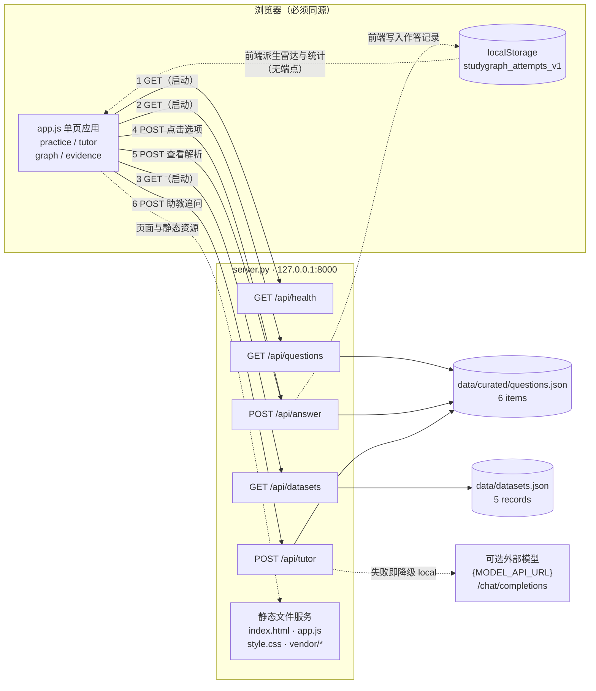

# 前端 - 后端接口字段映射对照表（交付物 2）

**项目**：StudyGraph — Graph-Grounded Diagnostic Study Assistant（JC2001 Group 5）
**交付物**：开工任务包（二）交付物 2 — 前端 - 后端接口字段映射对照表
**交付物责任人**：梁子铉（50106037，系统集成与接口映射，任务轮换自习羽赛）
**对接组长 / 审核人**：吴宇轩（50106070） / 江昊（50106065）
**关键交付节点**：2026 年 10 月 10 日（周六）22:00
**版本 / 取证日期**：v1.0 / 2026-10-09
**对接报告章节**：第 3 章（Requirements Engineering）、第 4 章（System Design and Architecture）、第 5 章（Implementation）

> **本表口径声明**：本表**对照仓库真实实现**（`frontend/app.js`、`frontend/index.html`、`server.py`）逐行整理，并**实测取证**。
> 任务包 `02_architecture_task.md` 中预置的示例表描述的是**旧原型的 FastAPI / 通义千问 / Neo4j 架构**，与本仓库实现不一致；差异逐条列于 §8，**请勿据此联调**。

---

## 0. 文档控制（Document Control）

### 0.1 版本历史

| 版本 | 日期 | 变更 | 作者 |
| :--- | :--- | :--- | :--- |
| v1.0 | 2026-10-09 | 首版：真实接口面盘点、字段映射、契约硬约束、错误矩阵、Gap 清单、实测取证（组内任务轮换接替） | 梁子铉 |

### 0.2 事实来源（全部为本仓库文件，行号已核对）

| 文件 | 行数 | 本文引用位置 |
| :--- | ---: | :--- |
| `server.py` | 228 | 路由 124/132/135/141/159；公开字段剥离 29-31；判题 34-48；本地导师 51-75；模型导师 78-117；错误 142/146/152/155/163/170；响应头 197-207 |
| `frontend/app.js` | 701 | 请求点 35/36/37/237/322/402；反馈渲染 276-310；存储 260-269；雷达 538-620；数据集表 622-642 |
| `frontend/index.html` | 325 | 视图 73/171/217/238；表单 195-201；按钮 180；SVG 231/281 |
| `data/curated/questions.json` | 290 | 6 道演示题的作者态 schema（含 `answer`/`explanation`/`misconceptions`） |
| `data/datasets.json` | 42 | 5 条数据集记录 |
| `tests/test_server.py` | 46 | 现有单元测试（覆盖公开字段剥离、错因映射完整性） |
| `tests/browser_smoke.js` | 94 | 浏览器冒烟测试（含"公开接口不得暴露答案"断言，第 33-39 行） |
| `tools/benchmark_api.py` | 72 | 现有接口性能工具（默认端口见 G-02） |

> **引用约定**：正文中的 `app.js` 与 `index.html` 均指 `frontend/` 目录下的同名文件；其余文件按上表路径书写，行号以 2026-10-09 的工作副本为准。

### 0.3 取证方式与日期

- **日期**：2026-10-09（服务器响应头 `Date: Fri, 09 Oct 2026 05:12:25 GMT`）
- **运行时**：`py server.py`（Python 3.14.0；`Server: StudyGraph/1.0 Python/3.14.0`），监听 `127.0.0.1:8000`
- **方法**：对 24 个用例逐一发出真实 HTTP 请求，**原始响应体与响应头全部留存并内联于附录 B**（未改写、未截断关键字段）
- **覆盖**：3 个成功 GET、2 个成功 POST、6 个业务错误、4 个不存在端点、3 个方法/体积错误等

### 0.4 署名依据与适用范围

| 项 | 内容 |
| :--- | :--- |
| 分工依据 | `02_architecture_task.md:3`（责任人）、`:96`（交付物 2 主责）、`:110`（交付路径） |
| 分工轮换依据 | 经组内统筹协商，开工任务包（二）交付物 2 由梁子铉（50106037，u14zl25@abdn.ac.uk）接替深化、实测取证并最终交付 |
| 仓库现状登记 | `docs/PROJECT_PROPOSAL_DRAFT.md:10-11` 登记学生为 Yuxuan Wu（50106070） |
| **适用范围** | 仅适用于本仓库 `frontend/` + `server.py` 的**本地实现** |
| **不适用** | 任务包所述的 FastAPI / 阿里云通义千问（Qwen-Turbo）/ Neo4j AuraDB 架构——该架构在本仓库**零实现**（见 §8） |

---

## 1. 结论摘要（TL;DR）

1. **真实接口面极小且自洽**：全前端共 **6 个 `fetch()` 调用点**（`app.js:35`、`36`、`37`、`237`、`322`、`402`），落在 **4 个真实端点**上，由 **4 个前端触发动作**发起。
2. **无缺失端点、无缺失字段**：前端请求的每一个路径后端都实现了；前端读取的每一个顶层字段后端都返回了。**目前不存在会导致联调失败的字段级缺口。**
3. **但有 3 条硬约束必须写死**（§5）：`misconception` 是**条件返回**字段（C-01）；`misconceptions` / `misconception` / localStorage 里的字符串是**三层同名不同型**（C-02）；**所有 `/api` 路径禁止附加查询串**，否则 404（C-03）。
4. **所有错误响应都是 HTML，不是 JSON**：成功响应是 `application/json; charset=utf-8`，错误响应是 `text/html;charset=utf-8`（Python `send_error()` 默认页）。任何按 JSON 解析错误体的调用方都会抛异常。
5. **"学情分析 / 掌握度雷达"没有后端端点**，由浏览器本地存储派生；"专项刷题 / 领域切换"是单次全量拉取后的**前端筛选**（§7）。
6. **任务包预置表的 4 个端点全部不存在**：`/api/quiz`、`/api/diagnose`、`/api/analytics/radar`、`/api/chat` 实测均返回 404（§8）。

---

## 2. 系统边界与调用总览

### 2.1 真实技术栈（与任务包描述不同）

| 任务包描述 | 本仓库真实实现 | 证据 |
| :--- | :--- | :--- |
| FastAPI 业务服务中枢 | Python 标准库 `http.server.ThreadingHTTPServer` + 自定义 `StudyGraphHandler` | `server.py:6`、`:120`、`:216` |
| 阿里云通义千问 Qwen-Turbo / DashScope SDK | 无。可选 OpenAI 兼容端点 `{MODEL_API_URL}/chat/completions`，键名取 `MODEL_NAME` | `server.py:78-115` |
| Neo4j AuraDB / Cypher 查询 | 无。图谱是每道题内嵌的 JSON 子图，前端渲染 SVG | `server.py`（无驱动）、`app.js:433-505` |
| RESTful `/api/*`（含查询参数） | 4 个 JSON 端点，但路由为 `self.path` **精确字符串比较**，**无路径参数、无查询参数** | `server.py:124/132/135/141` |

### 2.2 调用关系图（实测口径）



> 图中 1 / 2 / 3 三次 GET 由 `loadApplicationData` 的 `Promise.all` **并行**发起（`app.js:34-38`）；`/api/answer` 被 4、5 两条路径复用（提交作答与查看解析）。
> 本图的 `.mmd` 源、`.svg` 与 `.png` 导出件见交付包 `api_frontend_mapping/`。

### 2.3 三条路由事实（直接影响联调）

1. **不支持查询参数**：`server.py:124/132/135` 用 `self.path == "/api/health"` 等形式比较，**带 `?` 即不匹配**。实测 `GET /api/health?x=1` → **404**、`GET /api/questions?domain=all` → **404**。
2. **同源是硬约束**：响应头带 `Content-Security-Policy: ... connect-src 'self' ...`，页面只能请求同源接口；同时**没有任何 CORS 响应头**。前后端分离部署前必须先改 CSP 与 CORS（见 G-06）。
3. **404 有两种来源、报文不同**：GET 未知路径落入静态文件处理器 → `Message: File not found.`；POST 白名单外路径 → `server.py:142` 直接 `send_error(404)` → `Message: Not Found.`（附录 B 两例并列）。

---

## 3. 主表：前端 - 后端接口字段映射对照表

> **列说明**：`关联需求` 取自 `docs/REQUIREMENTS_TRACEABILITY.md`；`D` 行为**无后端调用**的前端派生模块（按 §7 规则保留，避免评审误判为"功能缺接口"）。

| # | 视图 / 模块 | 前端触发动作（函数：行） | 后端 URL | 方法 | 关键请求字段（Request Body） | 期望返回字段（Response，前端**实际读取**的字段） | 关联需求 |
| :---: | :--- | :--- | :--- | :---: | :--- | :--- | :--- |
| **R1** | 应用启动引导（全部视图的前置数据） | `DOMContentLoaded` → `loadApplicationData`（`app.js:24-30`、`32-54`） | `/api/questions` | `GET` | 无 body；**不得附加查询串**（C-03） | `Array[6]`，每项：`id`、`domain`、`domain_label`、`difficulty`、`review_status`、`topic`、`stem`、`options[{key,text}]`、`hint`、`dimensions[]`、`evidence[{label,detail}]`、`source{name,note}`、`graph{nodes[{id,label,type,description,x,y}],edges[{from,to,label}]}` | FR-01 / FR-02 / FR-05 / FR-06 |
| **R2** | 学习证据 · 数据集表 | 同上（`app.js:36`，渲染于 `622-642`） | `/api/datasets` | `GET` | 无 | `Array[5]`，每项读取：`name`、`purpose`、`status_class`、`status`、`license_review`（**`source` 字段返回但前端未读取**） | FR-05 / NFR-06 |
| **R3** | 顶栏服务状态 / 助教模式徽标 | 同上（`app.js:37`，用于 `44`、`377-378`、`651-656`） | `/api/health` | `GET` | 无 | `mode`（`"local"` \| `"model"`）——**仅此一个字段被读取**；`status` 返回但未使用 | FR-07 / NFR-02 |
| **R4** | 诊断练习 · 智能排雷（点击选项） | 点击 `.option-button`（生成于 `app.js:165-181`）→ `answerQuestion`（`app.js:225-274`） | `/api/answer` | `POST` | `{question_id: string, selected: "A"\|"B"\|"C"\|"D"}`（`app.js:240`；`Content-Type: application/json`） | `correct: boolean`、`selected: string`、`correct_key: string`、`explanation: string`、`dimensions: string[]`、`misconception: {title, detail, prerequisite}`（**仅 `correct === false` 时存在**，见 C-01） | FR-02 / FR-03 / NFR-03 |
| **R5** | 引导式助教 · 查看项目解析 | `#reveal-explanation`（`index.html:180`，绑定 `app.js:106`）→ `revealExplanation`（`app.js:312-340`） | `/api/answer` | `POST` | `{question_id: string, selected: string}`——`selected` **取自 localStorage 中该题最近一次作答**（`app.js:315`、`325`） | **仅 `explanation`**（`app.js:334`、`339`） | FR-04 |
| **R6** | 引导式助教 · 追问对话 | `#tutor-form` 提交（`index.html:195`，绑定 `app.js:108`）→ `submitTutorMessage`（`app.js:393-417`） | `/api/tutor` | `POST` | `{question_id: string, message: string}`（`app.js:405`）；`message` 已 trim，输入框 `maxlength="1200"`（`index.html:197`） | `reply: string`、`mode: "local" \| "model"`（`app.js:411-412`） | FR-04 / FR-07 |
| **D1** | 知识关系图 | 切换到图谱视图（`app.js:96-97`）→ `renderGraph`（`app.js:433-505`） | **无（前端派生）** | — | 数据源：R1 响应中的 `graph` | 节点按 `type`（`concept` / `prerequisite` / `misconception`）着色，`edges[].label` 作边标签；点击节点显示 `description`（`app.js:507-515`） | FR-06 |
| **D2** | 学情分析 · 掌握度雷达（含任务包中的"刷新雷达图"动作） | 切换到学习证据视图 / 每次作答后（`app.js:271-273`、`517-520`）→ `dimensionResults`（`538-550`）+ `renderRadar`（`578-620`） | **无（前端派生）** | — | 数据源：`localStorage["studygraph_attempts_v1"]`（见附录 A） | 五维 `{key, label, attempts, score, sufficient}`；`score = round(正确数 / 命中该维度的作答数 × 100)`，`sufficient = attempts >= 2` | FR-08（对应任务包 UC-05） |

**前端未使用的返回字段（非缺陷，记录备查）**：`/api/health.status`、`/api/datasets[].source`、`/api/answer.selected`（前端使用自己的 `selectedKey`，`app.js:232`、`263`）。

---

## 4. 接口契约明细

### 4.1 `GET /api/health`

| 项 | 内容 |
| :--- | :--- |
| 实现 | `server.py:124-131` |
| 请求 | 无参数、无 body；**不得带查询串** |
| 响应 200 | `application/json; charset=utf-8`，`Cache-Control: no-store` |

| 字段 | 类型 | 取值 | 前端读取 |
| :--- | :--- | :--- | :--- |
| `status` | string | 恒为 `"ok"` | **未读取** |
| `mode` | string | `"model"`（`MODEL_API_KEY`、`MODEL_API_URL`、`MODEL_NAME` 三者齐备）或 `"local"` | `app.js:44` |

**实测（`mode` 取决于服务端环境变量，非请求参数）**：

```json
{
  "status": "ok",
  "mode": "local"
}
```

**前端失败处理**：`healthResponse.ok` 为假时**不中断启动**，仅降级为 `"local"`（`app.js:44`）；而 `/api/questions` 或 `/api/datasets` 失败会抛错并替换整个工作区（`app.js:39-48`、`658-669`）。

### 4.2 `GET /api/questions`

| 项 | 内容 |
| :--- | :--- |
| 实现 | `server.py:132-134`，经 `public_question()`（`29-31`）剥离敏感字段 |
| 请求 | 无参数、无 body；**不支持 `?domain=` / `?limit=`**（C-03） |
| 响应 200 | JSON 数组，**6 条**（`data/curated/questions.json`）；实测 14,615 字节 |

| 字段 | 类型 | 说明 | 前端读取 |
| :--- | :--- | :--- | :--- |
| `id` | string | 如 `cs-pipeline-raw` | `app.js:240`、`261`、`325` |
| `domain` | string | `computer-science` / `software-engineering` | `app.js:122`、`262` |
| `domain_label` | string | 中文域标签 | `app.js:148`、`160` |
| `difficulty` | string | 如 `Intermediate` | `app.js:149` |
| `review_status` | string | 如 `Source review pending`；`app.js:151-154` 据此加 `pending` 样式 | `app.js:150`、`153` |
| `topic` | string | 考点标题 | `app.js:155`、`373`、`438` |
| `stem` | string | 题干 | `app.js:156`、`374` |
| `options` | array | `[{key:"A".."D", text:string}]`，固定 4 项 | `app.js:165-179` |
| `hint` | string | 一级提示（前端本地展示，不额外请求） | `app.js:218`、`388` |
| `dimensions` | string[] | 五维词表，取值见 §7.1 | `app.js:265`、`540` |
| `evidence` | array | `[{label, detail}]`，用于"当前推理依据"面板 | `app.js:159`、`161`、`194-201` |
| `source` | object | `{name, note}`，来源与免责说明 | `app.js:157-158` |
| `graph` | object | `{nodes:[{id,label,type,description,x,y}], edges:[{from,to,label}]}`，每题 5 个节点 | `app.js:375`、`466-504` |

**明确不返回（安全边界，已被测试断言）**：`answer`、`explanation`、`misconceptions`。实测 6 条记录中这三键出现次数均为 **0**；`tests/test_server.py:31-35` 与 `tests/browser_smoke.js:33-39` 均对此断言。**答对后 `correct_key` 才会由 `/api/answer` 返回。**

### 4.3 `GET /api/datasets`

| 项 | 内容 |
| :--- | :--- |
| 实现 | `server.py:135-137`（原样返回 `data/datasets.json`，无过滤、无错误分支） |
| 响应 200 | JSON 数组，**5 条**；实测 1,400 字节 |

| 字段 | 类型 | 前端读取 | 备注 |
| :--- | :--- | :--- | :--- |
| `name` | string | `app.js:627` | 数据集名 |
| `purpose` | string | `app.js:627` | 用途 |
| `status` | string | `app.js:635` | 状态文案 |
| `status_class` | string | `app.js:634` | `ready` / `planned`，作为 CSS 类名 |
| `license_review` | string | `app.js:638` | 许可核验说明 |
| `source` | string | **未读取** | URL 或本地路径 |

**注意**：`status_class` 会被直接拼进 `className`（`app.js:634`），属于**前端信任后端输出**的位置；若后端新增未经白名单校验的取值，会引入 CSS 类注入面（见 G-11）。

### 4.4 `POST /api/answer`（核心端点）

| 项 | 内容 |
| :--- | :--- |
| 实现 | `server.py:140-166`（白名单 `141`、体积校验 `144-147`、JSON 解析 `149-153`、题目校验 `154-156`、判题 `159-166`） |
| 调用方 | `app.js:237`（提交作答）、`app.js:322`（查看解析） |
| 请求头 | 必须 `Content-Type: application/json`（否则仍会尝试解析 body，但请勿依赖） |

| 请求字段 | 类型 | 必填 | 校验规则（实测） | 违反后果 |
| :--- | :--- | :---: | :--- | :--- |
| `question_id` | string | **是** | 必须存在于 6 条演示题 id 中；缺失 → `""` | 400 `Unknown question.` |
| `selected` | string | **是** | `str(...).strip().upper()` 后必须 ∈ {A,B,C,D}；**小写 `"b"` 合法**（回显为大写 `"B"`）；数字 `2`、缺失、`"E"` 均非法 | 400 `Answer must be A, B, C or D..`（注意尾部的两个句点，见 G-04） |

| 响应字段 | 类型 | 出现条件 | 前端读取 |
| :--- | :--- | :--- | :--- |
| `correct` | boolean | 恒出现 | `app.js:257`、`264`、`279`、`290` |
| `selected` | string | 恒出现（已大写） | **未读取** |
| `correct_key` | string | 恒出现 | `app.js:256`（用于给正确项加 `.correct` 样式） |
| `explanation` | string | 恒出现 | `app.js:307`、`334`、`339` |
| `dimensions` | string[] | 恒出现（取自题目） | `app.js:265`、`540` |
| `misconception` | object `{title, detail, prerequisite}` | **仅当 `correct === false`；`correct === true` 时该键完全不存在** | `app.js:266`、`283`、`287`、`292` |

**实测 · 答对（`selected: "B"`，无 `misconception` 键，401 字节）**：

```json
{
  "correct": true,
  "selected": "B",
  "correct_key": "B",
  "explanation": "后一条指令读取前一条尚未写回的结果，因此属于 Read After Write（RAW）真实相关。算术结果在前一条指令 EX 阶段结束时已经产生，可通过前递路径直接送到后一条指令的 ALU 输入。",
  "dimensions": [
    "conceptual_recall",
    "prerequisite_reasoning",
    "misconception_recognition"
  ]
}
```

**实测 · 答错（`selected: "A"`，附 `misconception`，602 字节）**：

```json
{
  "correct": false,
  "selected": "A",
  "correct_key": "B",
  "explanation": "后一条指令读取前一条尚未写回的结果，因此属于 Read After Write（RAW）真实相关。算术结果在前一条指令 EX 阶段结束时已经产生，可通过前递路径直接送到后一条指令的 ALU 输入。",
  "dimensions": [
    "conceptual_recall",
    "prerequisite_reasoning",
    "misconception_recognition"
  ],
  "misconception": {
    "title": "混淆顺序与乱序执行",
    "detail": "经典按序五级流水线不会因该场景产生 WAR 反相关。",
    "prerequisite": "RAW、WAR 与 WAW 的读写顺序定义"
  }
}
```

**前端失败处理**：任一非 2xx → `app.js:242` 抛错 → `showAnswerServiceError()`（`351-361`），并**恢复选项按钮可点击**（`244-252`）。

### 4.5 `POST /api/tutor`

| 项 | 内容 |
| :--- | :--- |
| 实现 | `server.py:140-176`（同一 `do_POST` 白名单；导师逻辑 `168-176`） |
| 导师实现 | 先试 `model_tutor_reply()`（`78-117`）；环境变量缺失或出现 `HTTPError/URLError/TimeoutError/KeyError/ValueError` → 返回 `None` → 回落到确定性本地导师 `local_tutor_reply()`（`51-75`） |

| 请求字段 | 类型 | 必填 | 校验规则 | 违反后果 |
| :--- | :--- | :---: | :--- | :--- |
| `question_id` | string | **是** | 同 4.4 | 400 `Unknown question.` |
| `message` | string | **是** | `strip()` 后非空且长度 ≤ 1200 | 400 `Invalid tutor request.` |

| 响应字段 | 类型 | 说明 | 前端读取 |
| :--- | :--- | :--- | :--- |
| `reply` | string | 导师回复（中文） | `app.js:411` |
| `mode` | string | `"local"` 或 `"model"`；前端据此显示 `Local project context` / `Model assisted, supplied context` | `app.js:412` |

**实测 · 本地模式（关键词命中"前置条件"分支，取 `evidence[0].detail` 构造反问）**：

```json
{
  "reply": "先检查这个条件：i+1 在 i 之后读取 R1，构成 RAW 依赖。 它在你的推理中是已明确成立，还是被默认跳过了？",
  "mode": "local"
}
```

**实测 · 用户直接索要答案时（本地导师拒绝直接给答案）**：

```json
{
  "reply": "我先不揭示选项。先判断后一条指令是要读取还是写入前一条指令产生的结果。 请先排除一个明显不满足条件的选项，并说明理由。",
  "mode": "local"
}
```

**前端失败处理**：非 2xx → `app.js:414-416` 追加一条 `Fallback` 消息，不抛出。

---

## 5. 契约硬约束（MUST / MUST NOT）

> 本节三条是本次对照表**必须写死**的项。报告第 4 章可直接引用编号。

### C-01（MUST）— `misconception` 是条件字段，调用方必须判空

- **契约**：`POST /api/answer` 仅在 `correct === false` 时返回 `misconception`；`correct === true` 时该键**完全不存在**（既不是 `null`，也不是空对象）。证据：附录 B `post_answer_correct`（401 字节）与 `post_answer_incorrect`（602 字节）对比。
- **违反后果**：`frontend/app.js:283` 与 `:287` 在 `result.correct` 为假时**无保护地**读取 `result.misconception.title` / `.detail`。一旦服务端返回 `correct:false` 却缺少该键（字段改名、网关重写、缓存、未来新增"部分正确"状态等），`renderAnswerFeedback` 抛出 `TypeError`；由于它在 `answerQuestion` 的 `try` 块之外，异常无人接管 → 反馈面板空白、选项保持禁用。
- **约束**：任何新增的错误分支必须保证 `correct:false ⇒ misconception 存在`；或前端改为 `result.misconception?.title ?? "已记录该错因"`（本表只登记，不改代码，见 G-01）。

### C-02（MUST NOT 混用）— 三个近名字段必须严格区分

| 名称 | 出现位置 | 形态 | 是否经网络传输 |
| :--- | :--- | :--- | :--- |
| `misconceptions` | 作者态 `data/curated/questions.json`（如 `:20-24`） | **对象**，以错误选项字母为键：`{"A": {title, detail, prerequisite}, ...}` | **否**（`server.py:30` 显式剥离） |
| `misconception` | 接口 `POST /api/answer` 响应 | **单数对象** `{title, detail, prerequisite}` | 是，且**条件返回**（C-01） |
| `misconception` | 浏览器 `localStorage` 作答记录（`app.js:266`） | **字符串**（仅 `title`）或 `null` | 否（本地持久化） |

- **违反后果**：把作者态 `misconceptions` 当接口字段用 → 永远 `undefined`；把接口态对象原样写回存储 → 与 `updateSummary`（`app.js:525-527`，用 `Set` 去重**字符串**）类型不符，导致"已诊断错因"计数恒为 1、雷达图失真。

### C-03（MUST）— 所有 `/api` 路径必须精确匹配，禁止附加查询串

- **契约**：`server.py:124/132/135/141` 全部使用 `self.path == "<字面量>"` 全等比较。**任何 `?` 都会导致不匹配。**
- **实测证据**（附录 B）：`GET /api/health?x=1` → 404；`GET /api/questions?domain=all` → 404；`POST /api/diagnose` → 404。
- **违反后果**：任务包示例表中 `?subject=economics&limit=5`、`?student_id=50106070` 这类调用一律 404。**领域筛选（FR-01）与题目切换必须在客户端完成**（`app.js:118-125`：一次全量 `/api/questions` 后按 `domain` 过滤）。
- **附带事实**：404 分两种来源与两种报文——GET 落入静态处理器为 `File not found.`，POST 白名单外为 `Not Found.`（`server.py:142`）。

---

## 6. 错误与边界行为矩阵（实测）

### 6.1 状态码与报文

| 状态 | Content-Type | 响应体 `Message:` | 触发条件 | 实现位置 | 前端行为 |
| ---: | :--- | :--- | :--- | :--- | :--- |
| 200 | `application/json; charset=utf-8` | —（正常 JSON） | 4 个端点的正常路径 | — | 正常渲染 |
| 400 | `text/html;charset=utf-8` | `Answer must be A, B, C or D..` | `selected` 缺失、非 A–D（含数字） | `server.py:161-164` | `showAnswerServiceError()`，按钮恢复可点 |
| 400 | `text/html;charset=utf-8` | `Unknown question.` | `question_id` 缺失或不在 6 条 id 内 | `server.py:154-156` | 同上 |
| 400 | `text/html;charset=utf-8` | `Invalid JSON.` | body 非法 JSON / 非 UTF-8 | `server.py:151-153` | 同上 |
| 400 | `text/html;charset=utf-8` | `Invalid request body size` | `Content-Length` ≤ 0 或 > 32,000（`MAX_BODY_BYTES`，`server.py:16`） | `server.py:144-147` | 同上 |
| 400 | `text/html;charset=utf-8` | `Invalid tutor request.` | `message` 为空/全空白 或 长度 > 1200 | `server.py:168-171` | 追加 `Fallback` 消息 |
| 404 | `text/html;charset=utf-8` | `File not found.` | GET 未知路径（含**任何带查询串的 `/api` 路径**） | 静态处理器 `translate_path`（`178-186`） | 启动期 → 致命面板；运行期 → 降级文案 |
| 404 | `text/html;charset=utf-8` | `Not Found.` | POST 白名单外路径（如 `/api/diagnose`、`/api/chat`） | `server.py:142` | 同上 |
| 501 | `text/html;charset=utf-8` | `Unsupported method ('PUT').` | 非 GET/POST 方法（PUT/DELETE/OPTIONS） | `http.server` 基类 | 无前端调用 |

### 6.2 全局要点

1. **错误响应体一律是 HTML**（`send_error()` 默认页），**不是 JSON**；且错误响应**没有** `Cache-Control`，并带 `Connection: close`。
2. **成功与失败的 Content-Type 不同**：`application/json; charset=utf-8`（带空格）vs `text/html;charset=utf-8`（无空格）。调用方应以 `response.ok` + Content-Type 双重判断，**不要**直接 `response.json()`。
3. **无 CORS 头**；页面侧还有 `connect-src 'self'`（见 §2.3）。
4. **无 405、无 401/403、无速率限制、无请求 ID**：未知方法为 501；无鉴权（单用户本地 PoC）；`POST /api/answer` 无重放保护（每次作答都会真实判题，但**不写服务端状态**——所有记录都在浏览器本地）。

### 6.3 全部 24 个取证用例（状态 / 类型 / 体积）

| 用例 | 方法 | 路径 | 状态 | Content-Type | 字节 |
| :--- | :--- | :--- | ---: | :--- | ---: |
| `get_health` | GET | `/api/health` | 200 | `application/json; charset=utf-8` | 33 |
| `get_health_query` | GET | `/api/health?x=1` | **404** | `text/html;charset=utf-8` | 460 |
| `get_questions` | GET | `/api/questions` | 200 | `application/json; charset=utf-8` | 14,615 |
| `get_questions_query` | GET | `/api/questions?domain=all` | **404** | `text/html;charset=utf-8` | 460 |
| `get_datasets` | GET | `/api/datasets` | 200 | `application/json; charset=utf-8` | 1,400 |
| `get_quiz` | GET | `/api/quiz?subject=economics&limit=5` | **404** | `text/html;charset=utf-8` | 460 |
| `get_radar` | GET | `/api/analytics/radar?student_id=50106070` | **404** | `text/html;charset=utf-8` | 460 |
| `get_root` | GET | `/` | 200 | `text/html` | 13,382 |
| `post_answer_correct` | POST | `/api/answer` `{B}` | 200 | `application/json; charset=utf-8` | 401 |
| `post_answer_lowercase` | POST | `/api/answer` `{b}` | 200 | `application/json; charset=utf-8` | 401 |
| `post_answer_incorrect` | POST | `/api/answer` `{A}` | 200 | `application/json; charset=utf-8` | 602 |
| `post_answer_bad_letter` | POST | `/api/answer` `{E}` | 400 | `text/html;charset=utf-8` | 485 |
| `post_answer_unknown_q` | POST | `/api/answer` `{does-not-exist}` | 400 | `text/html;charset=utf-8` | 473 |
| `post_answer_missing_selected` | POST | `/api/answer`（无 `selected`） | 400 | `text/html;charset=utf-8` | 485 |
| `post_answer_malformed` | POST | `/api/answer`（非法 JSON） | 400 | `text/html;charset=utf-8` | 469 |
| `post_answer_numeric_selected` | POST | `/api/answer` `{selected: 2}` | 400 | `text/html;charset=utf-8` | 485 |
| `post_tutor_local` | POST | `/api/tutor`（前置条件追问） | 200 | `application/json; charset=utf-8` | 172 |
| `post_tutor_ask_answer` | POST | `/api/tutor`（索要答案） | 200 | `application/json; charset=utf-8` | 205 |
| `post_tutor_empty` | POST | `/api/tutor`（空白 message） | 400 | `text/html;charset=utf-8` | 478 |
| `post_tutor_long` | POST | `/api/tutor`（1201 字符） | 400 | `text/html;charset=utf-8` | 478 |
| `post_diagnose` | POST | `/api/diagnose` | **404** | `text/html;charset=utf-8` | 455 |
| `post_chat` | POST | `/api/chat` | **404** | `text/html;charset=utf-8` | 455 |
| `post_oversize` | POST | `/api/answer`（>32,000 字节） | 400 | `text/html;charset=utf-8` | 482 |
| `put_answer` | PUT | `/api/answer` | **501** | `text/html;charset=utf-8` | 481 |

---

## 7. 前端派生模块（无后端端点）

> 本节回答评审最可能追问的问题："雷达图和图谱的数据到底从哪来？"——**它们不来自任何后端端点**。

### 7.1 五维词表（唯一权威来源）

| key | 中文标签 |
| :--- | :--- |
| `conceptual_recall` | 概念回忆 |
| `prerequisite_reasoning` | 前置推理 |
| `misconception_recognition` | 误区识别 |
| `cross_topic_reasoning` | 跨主题推理 |
| `procedural_accuracy` | 过程准确性 |

来源：`app.js:1-7`（前端副本）+ `tools/validate_project.py:12-18`（离线校验脚本副本）。**注意两份词表是各自硬编码的**：`tools/validate_project.py:63-67` 会在内容校验时拒绝未知维度、并在 `74-75` 要求五维全覆盖，但该脚本需人工运行，且**无法发现两份副本之间的漂移**；运行期 `server.py:44` 亦不校验，`/api/answer` 的 `dimensions` 是题目字段的透传（见 G-08）。

### 7.2 掌握度雷达与统计（对应任务包"刷新掌握度雷达图"）

| 指标 | 推导公式（`app.js`） |
| :--- | :--- |
| 五维得分 | `score = round(命中该维度的正确作答数 / 命中该维度的作答总数 × 100)`（`538-550`） |
| 证据充分性 | `sufficient = 命中次数 >= 2`；不足时进度条按 0 展示并标注"证据不足"（`547`、`564-571`） |
| 会话正确率 | `round(正确数 / 总作答数 × 100)`，无作答时显示 `--`（`522-536`） |
| 已诊断错因 | 作答记录中 `misconception` **字符串**去重计数（`525-527`） |
| 雷达图形状 | 5 个顶点，半径按 `score/100` 缩放；`insufficient` 维度按 0 绘制（`578-620`） |

### 7.3 知识关系图

- 数据源：R1 响应中每题的 `graph` 字段（节点含固定 `x`/`y` 坐标）。
- 渲染：`renderGraph`（`433-505`）直接以 `x,y` 画 SVG 矩形与连线；`type` 决定描边色与线宽（`concept` 3px，其余 2px）。
- **没有图数据库、没有 Cypher、没有服务端图查询**（与任务包图 3 时序图描述不符，见 §8）。

### 7.4 数据集表

- 数据源：R2 响应；渲染于 `622-642`；列 = `name` / `purpose` / `status` / `license_review`。

---

## 8. 与任务包预置表的差异说明

### 8.1 四个端点：预置表 vs 真实实现

| 任务包预置表（`02_architecture_task.md:99-104`） | 真实实现 | 实测 |
| :--- | :--- | :--- |
| `GET /api/quiz` `?subject=economics&limit=5` → `questions:[{id, stem, options, subject}]` | **不存在**。题目加载是 `GET /api/questions`（全量 6 条，无参数）；领域筛选在客户端（`app.js:118-125`） | **404** |
| `POST /api/diagnose` `{question_id, selected_option}` → `{is_correct, trap_name, concept, analysis}` | **不存在**。判题是 `POST /api/answer` `{question_id, selected}` → `{correct, correct_key, explanation, dimensions, misconception?}` | **404** |
| `GET /api/analytics/radar` `?student_id=50106070` → `{dimensions, scores, weak_points}` | **不存在**。雷达图由 `localStorage` 在前端计算（§7.2），**并且系统没有 student_id 概念**（无用户/会话/鉴权） | **404** |
| `POST /api/chat` `{question_id, user_message, history}` → `{reply_text, follow_up_hints}` | **不存在**。导师对话是 `POST /api/tutor` `{question_id, message}` → `{reply, mode}`；**不接受 `history`**（每次请求无状态，上下文由当前题目证据在服务端重建） | **404** |

> 上表 4 个路径的**请求字段名**（`selected_option`、`user_message`、`history`、`student_id`、`subject`、`limit`）在整个仓库的 `frontend/` 与 `server.py` 中**出现次数为 0**。

### 8.2 任务包用例（UC-01…UC-08）→ 真实视图映射

| 任务包用例 | 真实承载 | 后端交互 |
| :--- | :--- | :--- |
| UC-02 专项自测刷题 | 诊断练习视图（`index.html:73-169`） | `GET /api/questions`，领域筛选为客户端行为 |
| UC-01 错题智能排雷诊断 | 点击选项 → 反馈面板（`app.js:225-310`） | `POST /api/answer`，读 `misconception` |
| UC-03 检索考点知识点 | 学习证据面板的 `evidence` / `topic` 列表（`app.js:191-204`） | `GET /api/questions`（**无独立检索端点**） |
| UC-04 浏览图谱拓扑关联 | 知识关系图视图（`index.html:217-236`） | `GET /api/questions` 的 `graph`，前端渲染 |
| UC-05 查看学情掌握度雷达 | 学习证据视图雷达（`index.html:281`） | **无后端交互**（前端派生，§7.2） |
| UC-08 苏格拉底导师追问 | 引导式助教视图（`index.html:171-215`） | `POST /api/tutor` |
| UC-07 变式题自适应强化 | **无对应实现**（无视图、无端点、无数据字段） | — |
| （UC-06 未在任务包用例图中列出） | — | — |

### 8.3 差异根因

任务包描述的是**改造前的原型**（浏览器直连模型、凭据存 `localStorage`、Neo4j 图谱）。重建后的 PoC 已刻意移除这些依赖：见 `notes.md:11-17`（"Python 文件含真实感凭据"、"API key 存在浏览器 localStorage"等审计结论）、`docs/PROJECT_DEFINITION.md:65`（图数据库"可在本地流程与评测稳定后再作为适配器引入"）、`docs/REQUIREMENTS_TRACEABILITY.md:14`（NFR-02 离线可靠性）。**因此本表以真实实现为准；任务包图件如需复用，必须先按 §8.1 改写端点与字段。**

---

## 9. Gap / 偏离清单（只记录，不改代码）

> 依据决策：本交付物**不修改任何源码**（改 `app.js`/`index.html` 会使其他交付物的截图、浏览器冒烟测试与报告配图证据失效）。以下为建议修法与影响面，交由实现方决策。

| # | 现象 | 证据 | 影响 | 建议 | 优先级 |
| :--- | :--- | :--- | :--- | :--- | :---: |
| **G-01** | 答错分支无保护读取 `result.misconception` | `app.js:283`、`:287`（`server.py:46-47` 条件返回） | 契约分歧时抛 `TypeError`，反馈面板空白且按钮禁用 | 前端改可选链 + 兜底文案；或后端保证 `correct:false ⇒ misconception 必存在`（见 C-01） | **高** |
| **G-02** | 端口漂移：文档写 8000，工具默认 8765 | `README.md:13` vs `tools/benchmark_api.py:32`、`tests/browser_smoke.js:4` | 照文档启动后直接跑基准/冒烟测试会连接被拒：实测 `URLError: [WinError 10061]`；改 `--base-url http://127.0.0.1:8000` 后通过（questions p95 16.51 ms / answer 16.22 ms / tutor 16.15 ms，20 次） | 统一为 8000（或让工具读 `STUDYGRAPH_PORT`） | **高** |
| **G-03** | `index.html:269` 硬编码 "10,414"（MMLU+OpenBookQA） | `index.html:267-271`；该数字不来自任何端点 | 数据一旦更新，界面数字即失真；与 `data/datasets.json` 的 4,457 + 5,957 需人工同步 | 改为渲染期按 `/api/datasets` 计算，或明确标注为静态说明 | 中 |
| **G-04** | 错误响应为 HTML 且文案有瑕疵 | 附录 B `post_answer_bad_letter`：`Message: Answer must be A, B, C or D..`（双句点，源于 `server.py:163` 传入已带句点的消息 + `send_error` 自动追加） | 调用方难以程序化解析错误；文案不严谨 | 统一 JSON 错误封装 `{error, message}`；修正句点 | 中 |
| **G-05** | 不支持查询参数，带 `?` 即 404 | `server.py:124/132/135` 全等比较；实测 404 | 任务包示例表的调用方式全部失效；未来分页/筛选需改路由 | 若需服务端筛选，先实现 `urlparse` 解析并保持向后兼容 | 中 |
| **G-06** | 无 CORS 头 + CSP `connect-src 'self'` | 附录 B 响应头 | 前后端分离（不同端口/域名）联调会同时被 CSP 与同源策略阻断 | 确认单机同源部署；若必须分离，需同时调整 CSP 与 CORS | 中 |
| **G-07** | 答错时误区文案被渲染两次 | `app.js:283` 设标题，`:285-288` 立即用 `detail` 覆盖正文 | 冗余分支，逻辑不清但无功能故障 | 合并为一个三元表达式 | 低 |
| **G-08** | 五维词表存在**两份硬编码副本**，运行期无任何校验 | `app.js:1-7` vs `tools/validate_project.py:12-18`；运行期 `server.py:44` 直接透传 | 两份副本一旦漂移（前端改名/新增维度），离线校验脚本仍会通过，而雷达图按 key 匹配（`app.js:540`）会**静默漏掉**该维度、不报错 | 词表提升为单一共享来源（如 `data/dimensions.json`），由校验脚本与前端共同引用 | 中 |
| **G-09** | 本机 `python` 不可用（Windows 商店占位符） | 实测：`python server.py` → `Program 'python.exe' failed to run`；`py server.py` → 正常（Python 3.14.0） | 按 `README.md:10` 的 `python server.py` 在同类环境会直接失败 | README 补注 `py server.py` 备用命令 | 中（环境） |
| **G-10** | 任务包用例 UC-07（变式题自适应强化）无任何实现 | §8.2；仓库内无对应端点、视图或数据字段 | 报告第 3/4 章若引用任务包用例图会与实现不符 | 在报告中明确标注为"未实现/未来工作" | 中 |
| **G-11** | `status_class` 被直接拼入 CSS 类名 | `app.js:634`；数据源 `data/datasets.json:6` 等 | 后端若输出任意字符串即形成 CSS 类注入面（当前数据为受控常量，风险低） | 加白名单 `{ready, planned}` | 低 |

---

## 10. 联调验收清单

| # | 检查项 | 期望 | 通过标准 |
| :---: | :--- | :--- | :--- |
| 1 | `GET /api/health` | 200 JSON | `mode` ∈ {`local`,`model`}；`status` 恒为 `ok` |
| 2 | `GET /api/questions` | 200 JSON 数组 | 长度 6；每项**不含** `answer`/`explanation`/`misconceptions` |
| 3 | `GET /api/questions?domain=all` | **404** | 证明无查询参数（C-03）；筛选由前端完成 |
| 4 | `GET /api/datasets` | 200 JSON 数组 | 长度 5；6 个字段齐备 |
| 5 | `POST /api/answer` 正确项 | 200 JSON | `correct:true`；**无** `misconception` 键 |
| 6 | `POST /api/answer` 错误项 | 200 JSON | `correct:false`；`misconception.title/detail/prerequisite` 三者齐备 |
| 7 | `POST /api/answer` `selected:"b"` | 200 JSON | `selected` 回显为大写 `"B"` |
| 8 | `POST /api/answer` `selected:"E"` / 缺失 / 数字 | 400 | **HTML** 响应体；前端走 `showAnswerServiceError` 且按钮恢复 |
| 9 | `POST /api/answer` 未知 `question_id` | 400 | `Unknown question.` |
| 10 | `POST /api/tutor` 正常提问 | 200 JSON | `reply` 非空、`mode` ∈ {`local`,`model`} |
| 11 | `POST /api/tutor` 空白 / 1201 字符 | 400 | `Invalid tutor request.` |
| 12 | body > 32,000 字节 | 400 | `Invalid request body size` |
| 13 | `PUT`/`DELETE`/`OPTIONS` | 501 | 方法不支持（无 405） |
| 14 | 响应头 | 每个响应 | 含 `nosniff`、`Referrer-Policy`、`Permissions-Policy`、CSP；JSON 响应另含 `Cache-Control: no-store` |
| 15 | 浏览器工作流 | 4 视图无控制台报错 | 复用 `tests/browser_smoke.js`（注意端口，见 G-02） |

---

## 附录 A. `localStorage` 契约：`studygraph_attempts_v1`

该键是**前端本地存储契约**，也是"学情分析"（D2）唯一的数据来源，因此纳入本文档。

- **键名**：`studygraph_attempts_v1`（`app.js:9`）
- **形态**：数组，元素为一次作答记录
- **写入**：`app.js:260-269`（每次 `POST /api/answer` 成功后 `push` 并整体写回）
- **读取**：`app.js:20`（初始化）、`315`（查该题最近一次作答）、`522-550`（统计与雷达）
- **清除**：`app.js:644-649`（"清除本地记录"，带 `confirm`）
- **容错**：`readJsonStorage`（`680-687`）解析失败或非数组时回退为 `[]`
- **另有** `studygraph_theme_v1`（`app.js:10`）仅存主题偏好，与接口无关

| 字段 | 类型 | 来源 | 说明 |
| :--- | :--- | :--- | :--- |
| `question_id` | string | 当前题目 `id` | 与 `/api/answer` 请求同源 |
| `domain` | string | 当前题目 `domain` | 用于按域统计 |
| `selected` | string | 用户点击的选项字母 | **不是**响应里的 `selected`（虽然值相同） |
| `correct` | boolean | 响应 `correct` | — |
| `dimensions` | string[] | 响应 `dimensions` | 原样存储，用于雷达聚合 |
| `misconception` | **string \| null** | `result.misconception?.title \|\| null`（`app.js:266`） | **仅存标题字符串**，不是对象（见 C-02） |
| `timestamp` | string | `new Date().toISOString()` | ISO 8601 |

```json
{
  "question_id": "cs-pipeline-raw",
  "domain": "computer-science",
  "selected": "A",
  "correct": false,
  "dimensions": ["conceptual_recall", "prerequisite_reasoning", "misconception_recognition"],
  "misconception": "混淆顺序与乱序执行",
  "timestamp": "2026-10-09T05:12:25.000Z"
}
```

---

## 附录 B. 取证记录（原始响应内联）

### B.0 环境与命令

| 项 | 值 |
| :--- | :--- |
| 日期 | 2026-10-09 |
| 服务启动 | `py server.py`（工作目录 = 仓库根）→ `StudyGraph is running at http://127.0.0.1:8000` |
| 服务器标识 | `Server: StudyGraph/1.0 Python/3.14.0`（`server.py:121`） |
| 请求工具 | Python 3.14 标准库 `urllib.request`（逐用例真实 HTTP 调用；`Content-Type: application/json`） |
| 原始产物 | 每个用例的响应体与响应头逐字节留存后内联于下 |
| 说明 | 使用 `py` 而非 `python`：本机 `python.exe` 为不可启动的商店占位符（G-09） |

### B.1 成功响应头（`GET /api/health` 200）

```
HTTP 200
Server: StudyGraph/1.0 Python/3.14.0
Date: Fri, 09 Oct 2026 05:12:25 GMT
Content-Type: application/json; charset=utf-8
Content-Length: 33
Cache-Control: no-store
X-Content-Type-Options: nosniff
Referrer-Policy: no-referrer
Permissions-Policy: camera=(), microphone=(), geolocation=()
Content-Security-Policy: default-src 'self'; style-src 'self'; script-src 'self'; img-src 'self' data:; connect-src 'self'; object-src 'none'; base-uri 'none'; frame-ancestors 'none'
```

### B.2 错误响应头（`POST /api/answer` `selected:"E"` 400）

```
HTTP 400
Server: StudyGraph/1.0 Python/3.14.0
Date: Fri, 09 Oct 2026 05:12:25 GMT
Connection: close
Content-Type: text/html;charset=utf-8
Content-Length: 485
X-Content-Type-Options: nosniff
Referrer-Policy: no-referrer
Permissions-Policy: camera=(), microphone=(), geolocation=()
Content-Security-Policy: default-src 'self'; style-src 'self'; script-src 'self'; img-src 'self' data:; connect-src 'self'; object-src 'none'; base-uri 'none'; frame-ancestors 'none'
```

### B.3 `POST /api/answer` — 答错（200，附 `misconception`）

```json
{
  "correct": false,
  "selected": "A",
  "correct_key": "B",
  "explanation": "后一条指令读取前一条尚未写回的结果，因此属于 Read After Write（RAW）真实相关。算术结果在前一条指令 EX 阶段结束时已经产生，可通过前递路径直接送到后一条指令的 ALU 输入。",
  "dimensions": ["conceptual_recall", "prerequisite_reasoning", "misconception_recognition"],
  "misconception": {
    "title": "混淆顺序与乱序执行",
    "detail": "经典按序五级流水线不会因该场景产生 WAR 反相关。",
    "prerequisite": "RAW、WAR 与 WAW 的读写顺序定义"
  }
}
```

### B.4 `POST /api/answer` — 答对（200，**无** `misconception` 键）

```json
{
  "correct": true,
  "selected": "B",
  "correct_key": "B",
  "explanation": "后一条指令读取前一条尚未写回的结果，因此属于 Read After Write（RAW）真实相关。算术结果在前一条指令 EX 阶段结束时已经产生，可通过前递路径直接送到后一条指令的 ALU 输入。",
  "dimensions": ["conceptual_recall", "prerequisite_reasoning", "misconception_recognition"]
}
```

### B.5 400 错误响应体（HTML，非 JSON）

```html
<!DOCTYPE HTML>
<html lang="en">
    <head>
        <meta charset="utf-8">
        <style type="text/css">
            :root {
                color-scheme: light dark;
            }
        </style>
        <title>Error response</title>
    </head>
    <body>
        <h1>Error response</h1>
        <p>Error code: 400</p>
        <p>Message: Answer must be A, B, C or D..</p>
        <p>Error code explanation: 400 - Bad request syntax or unsupported method.</p>
    </body>
</html>
```

其余 400 文案实测值：`Unknown question.`（未知 id）、`Invalid JSON.`（非法 JSON）、`Invalid request body size`（超 32,000 字节）、`Invalid tutor request.`（空白或超 1200 字符）。

### B.6 两种 404 的报文差异

`GET /api/questions?domain=all` → 静态处理器（`File not found.`）：

```html
        <h1>Error response</h1>
        <p>Error code: 404</p>
        <p>Message: File not found.</p>
        <p>Error code explanation: 404 - Nothing matches the given URI.</p>
```

`POST /api/diagnose` → `server.py:142`（`Not Found.`）：

```html
        <h1>Error response</h1>
        <p>Error code: 404</p>
        <p>Message: Not Found.</p>
        <p>Error code explanation: 404 - Nothing matches the given URI.</p>
```

### B.7 501 响应体（`PUT /api/answer`）

```html
        <h1>Error response</h1>
        <p>Error code: 501</p>
        <p>Message: Unsupported method ('PUT').</p>
        <p>Error code explanation: 501 - Server does not support this operation.</p>
```

### B.8 `GET /api/questions` 结构核验

- 数组长度：**6**
- 单条记录的键（升序）：`difficulty`, `dimensions`, `domain`, `domain_label`, `evidence`, `graph`, `hint`, `id`, `options`, `review_status`, `source`, `stem`, `topic`
- 6 条 id：`cs-pipeline-raw`, `cs-cache-fields`, `cs-tlb-page-fault`, `se-process-model`, `se-dependency-inversion`, `se-boundary-mutation`
- 敏感键出现次数（逐条统计，共 6 条）：`answer` → **0**；`explanation` → **0**；`misconceptions` → **0**
- 每题 `graph.nodes` 长度：**5**

### B.9 `GET /api/datasets` 单条记录（第 1 条，共 5 条）

```json
{
  "name": "MMLU computer science subsets",
  "purpose": "Baseline multiple-choice evaluation",
  "status": "4,457 local records prepared",
  "status_class": "ready",
  "license_review": "Repository includes MIT; verify subject-content redistribution before packaging",
  "source": "https://github.com/hendrycks/test"
}
```

### B.10 附带的性能与工具核验

| 命令 | 结果 |
| :--- | :--- |
| `py tools/benchmark_api.py`（默认 8765） | **失败**：`urllib.error.URLError: <urlopen error [WinError 10061] 由于目标计算机积极拒绝，无法连接。>`（G-02） |
| `py tools/benchmark_api.py --base-url http://127.0.0.1:8000 --iterations 20` | **通过**：`questions: median=13.25 ms, p95=16.51 ms`；`answer: median=15.46 ms, p95=16.22 ms`；`tutor: median=14.96 ms, p95=16.15 ms` |

---

## 附录 C. English Abstract

**Frontend–Backend Interface Field Mapping (Deliverable 2)**

This document records the complete HTTP interface between the StudyGraph browser application and its Python service, derived line by line from `frontend/app.js`, `frontend/index.html` and `server.py`, and verified against a running instance on 9 October 2026. The whole interface consists of six `fetch()` call sites issued by four user-triggered actions and served by four endpoints: `GET /api/health`, `GET /api/questions`, `GET /api/datasets`, `POST /api/answer` and `POST /api/tutor`. Every path the frontend requests is implemented, and every top-level field the frontend reads is returned, so no field-level integration gap exists today. Three contract constraints nevertheless require explicit enforcement: `misconception` is returned only when `correct` is false and is read without a guard at `app.js:283` and `287`; the authoring key `misconceptions` (a distractor-keyed object), the API key `misconception` (a conditional object) and the persisted `misconception` (a plain string) are three different shapes sharing almost the same name; and because routing compares `self.path` for exact equality, any query string yields HTTP 404, which invalidates the query-parameter calls shown in the original group assignment brief. Successful responses are JSON, whereas every error response is an HTML page produced by `send_error()`, with no CORS headers and a `connect-src 'self'` content security policy, so same-origin deployment is mandatory. Two modules have no backend endpoint at all: the mastery radar is computed in the browser from `localStorage["studygraph_attempts_v1"]`, and domain filtering is client-side over the single question payload. Section 8 reconciles the real implementation with the four endpoints named in the course assignment brief — `/api/quiz`, `/api/diagnose`, `/api/analytics/radar` and `/api/chat` — none of which exists in this repository; Section 9 lists eleven recorded deviations with suggested remedies, and Appendices A and B preserve the local-storage schema and the verbatim captured responses.
