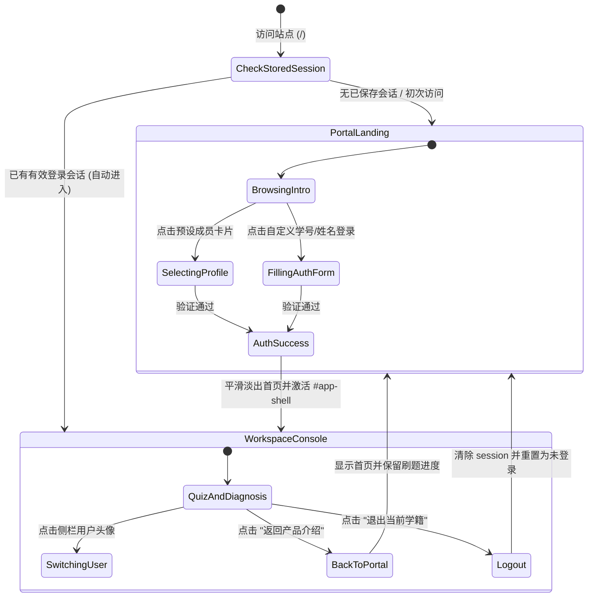

# 技术调研与架构决策报告 (Phase 0: Research)

**功能编号**：`001-landing-and-auth-portal`  
**关联规格**：`specs/001-landing-and-auth-portal/spec.md`  
**完成时间**：2026-10-08  

---

## 1. 调研背景与技术选型问题

为了解决“从首页直接进入冷峻高密度的 Eval Harness 导致体验突兀”的问题，并响应用户需求“做一个登录或者说介绍页面然后再进入我平时的那个界面”，团队开展了针对系统架构、状态机模型与交互设计的专题调研。

---

## 2. 核心架构决策 (Decisions, Rationale & Alternatives)

### 决策 1：页面承载架构 —— 单页容器切换 (SPA Dual-Container) vs 多物理页面 (MPA)
- **技术选择**：选用 **SPA 双容器视窗平滑切换架构** (`#portal-landing` 与 `#app-shell` 并存于 `frontend/index.html`)。
- **决策理由**：
  1. **零白屏与秒级响应**：静态资源（JetBrains Mono、SVG 图标、ECharts 引擎）只需在首次进入加载一次，进入/退出工作台无刷新转场，转场时间 < 150ms。
  2. **状态保活与平滑回退**：用户在工作台刷题到第 2 题时，点击“返回介绍页”查看课题背景，再点击“继续学习”返回时，无需重新请求题目，原刷题状态与抽屉完全保留。
  3. **后端契约零破坏**：FastAPI 后端依然只需挂载静态目录 `app.mount("/", StaticFiles(directory=FRONTEND_DIR, html=True), name="frontend")`，无需新增或修改任何后端页面路由映射。
- **考虑的替代方案**：
  - *方案 B (拆分为 landing.html + app.html)*：需要维护两个 HTML 骨架与重复的 CSS 变量，页面跳转存在显著白屏闪烁，跨页面传递刷题状态需依赖复杂的 Session Storage 事件监听，故拒绝。

---

### 决策 2：学生档案与身份鉴权策略 —— 本地学籍持久化 + FastAPI 轻量模拟
- **技术选择**：选用 **客户端智能持久化存储 (`localStorage`) + 预设角色矩阵 + 可选后端会话合同**。
- **决策理由**：
  1. **符合 JC2001 本科教学与答辩演示边界**：避免在 Phase 2 早期引入繁重的 PostgreSQL/OAuth 鉴权数据库，保证在任何无网、断网或沙箱环境下 100% 可演示、0 故障。
  2. **支持快速评测与答辩一键切换**：预置阿伯丁大学 Group 5 核心组员学籍卡片（吴宇轩 50106070、林泳桐 50106038 等），答辩演示时无需手动键入复杂密码，一键即可载入专属角色。
- **考虑的替代方案**：
  - *方案 B (JWT + SQLite 集中式鉴权)*：在 Phase 2 初级阶段过度设计，容易增加依赖环境部署失败率，不符合“本科生高质量轻量工程”原则。

---

### 决策 3：视觉风格与设计语言 —— 学术科技感双模自适应 (Adaptive Academic Tech)
- **技术选择**：基于原有 `--bg-main`, `--card-bg`, `--primary-500`, `--text-main` 等 CSS 变量，构建兼顾**阿伯丁大学蓝 (Aberdeen Blue `#1e3a8a`/`#3b82f6`)** 与 **DeepSeek 暗夜极客风** 的响应式卡片网格。
- **决策理由**：
  1. 保证与用户“平时的界面”在视觉基因上高度统一，避免“首页像电商、后台像终端”的撕裂感。
  2. 提供高质感的微渐变毛玻璃 (Backdrop Blur) 和卡片悬浮动效，提升评审时的第一印象。
- **考虑的替代方案**：
  - *方案 B (引入 Bootstrap/Tailwind CDN)*：外部 CSS 框架会污染原有原生样式并造成类名冲突，故完全采用原生 CSS 变量扩展。

---

## 3. 状态转换矩阵与生命周期 (State Machine)

---

## 4. 关键未知项与澄清项结论 (Resolutions)

| 未知项 / 澄清点 | 最终决定 | 影响与约束 |
| :--- | :--- | :--- |
| **Q1: 用户首次打开进入哪个页面？** | 默认展示 **产品介绍与登录门户 (Portal)**，便于导师与新用户了解全貌；若勾选“记住我并在下次直接进入工作台”或已有持久化身份，提供明显快捷入口。 | 首页需保留醒目的“立即进入系统”主行动号召按钮 (CTA)。 |
| **Q2: 原有的 4 个标签页与刷题数据是否受影响？** | **完全零影响**。原有的 `#view-quiz`, `#view-tutor`, `#view-graph`, `#view-report` 均完整保留在 `#app-shell` 内。 | 保证现有 114 个 pytest 测试及 E2E 测试全部平滑通过。 |
| **Q3: 移动端/小屏幕适配要求？** | 门户采用 CSS Grid / Flex 响应式断点（`@media (max-width: 768px)`），小屏幕下卡片自适应为单列瀑布流。 | 保证手机端或平板端展示时体验良好。 |
